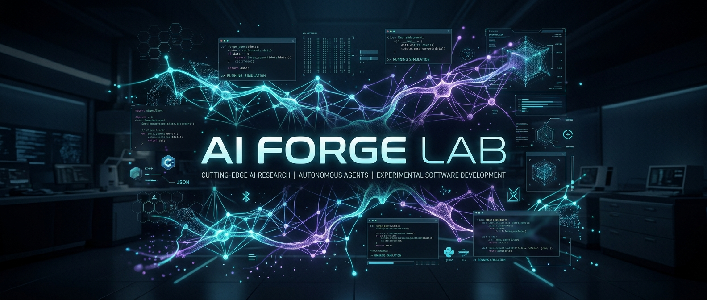

# 🛠️ AI Forge Lab



Welcome to the **AI Forge Lab**, a premier collection of cutting-edge AI research, autonomous agents, and experimental demos. This repository serves as a centralized hub for projects exploring the boundaries of LLM reasoning, autonomous workflows, and innovative RAG architectures.

---

## 🚀 Featured Projects

| Project                                      | Description                                                                         | Key Tech                        |
| :------------------------------------------- | :---------------------------------------------------------------------------------- | :------------------------------ |
| [**OpenEvolve**](./openevolve-guide)         | Framework for building self-evolving AI agents that improve their own code.         | Python, LLMs, Process Isolation |
| [**Auto-Research**](./auto-research-guide)   | Automated technical and scientific research workflows powered by AI.                | LangChain, Research APIs        |
| [**Fine-Tuning Guide**](./finetuning-guide)  | Comprehensive reference for fine-tuning LLMs (LoRA, QLoRA, DPO, RLHF).              | PEFT, bitsandbytes, TRL         |
| [**MCP Chatbot**](./mcp-chatbot)             | A modular chatbot implementation using the Model Context Protocol (MCP).            | LangChain, MCP, Groq            |
| [**Podcast Automate**](./podcast-automate)   | End-to-end automation for podcast production, from script to speech.                | Maya1, TTS, LLMs                |
| [**A2A Guide**](./a2a-guide)                 | Action-to-Action guide: practical examples and patterns for chaining agent actions. | Examples, Guides                |
| [**Vectorless RAG**](./vectorless-llm-evals) | Evaluating RAG systems using PageIndex for hierarchical, vectorless retrieval.      | PageIndex, LangSmith            |
| [**Graph LLMs**](./graph-llms)               | Integrating Knowledge Graphs (Neo4j) with LLM reasoning for complex queries.        | Neo4j, Cypher, Groq             |
| [**GPT-Scratch**](./gpt-scratch)             | Build, deconstruct, and train decoder-only Generative Pre-trained Transformers.     | PyTorch, tiktoken, GPT-2        |
| [**Long-Context Compliance**](./long-document-context) | Multi-agent, multi-pass pipeline for extracting and synthesizing compliance evidence from long PDFs. | FastAPI, Groq, Datalab OCR, BM25 |
| [**RLM Research Agent**](./rlm-test)         | In-memory deep-research agent over a local markdown corpus using recursive decomposition. | FastAPI, LangChain, LangGraph, OpenAI |
| [**RPG World Simulator**](./world-simulator) | Interactive RPG sandbox with Gemini world transition engine, memory reflection, and emergent economy. | FastAPI, Gemini, NetworkX, Cytoscape.js |
| [**MemGPT Git Agent**](./memgpt-test)        | Self-contained MemGPT agent with tiered memory (persona, human, document catalog, recall, archival) and versioned "memory git". | FastAPI, SQLite, NumPy, OpenAI, MarkItDown |
| [**TurboQuant Personal AI**](./turboquant-test) | Folder-based personal AI assistant with perfect memory powered by TurboVec quantization and hybrid retrieval. | FastAPI, SQLite, TurboVec, FAISS, OpenAI |
| [**Company Knowledge Builder**](./okf%2Bllm%20wiki) | Ingests heterogeneous files, analyzes dependencies, and builds an AI-queryable OKF wiki. | Python 3.14, FastAPI, Gemini 3, SQLite, sqlite-vec, NetworkX |
| [**Omni-Agent**](./harness-ultimate)         | Agentic research harness executing parallel sub-agents with planning and self-correction. | Python 3.14, FastAPI, Gemini, SQLAlchemy, NetworkX, MarkItDown |

---

## 🛠️ Getting Started

This repository uses **Git Submodules** to manage individual projects. To get everything up and running:

### 1. Clone the Repository

```bash
git clone --recursive https://github.com/subho004/ai-forge-lab.git
cd ai-forge-lab
```

### 2. Initialize Submodules (if already cloned)

```bash
git submodule update --init --recursive
```

### A2A Guide submodule

This repository includes the A2A Guide as a git submodule. It's located at `a2a-guide` and sourced from https://github.com/subho004/a2a-guide.

To initialize or update only this submodule after cloning:

```bash
git submodule update --init a2a-guide
cd a2a-guide
git pull origin main
cd ..
```

You can inspect the submodule contents in `a2a-guide` and follow its README for usage examples.

### GPT-Scratch submodule

This repository includes the GPT-Scratch Laboratory as a git submodule. It's located at `gpt-scratch` and sourced from https://github.com/subho004/attention-to-gpt-scratch.

To initialize or update only this submodule after cloning:

```bash
git submodule update --init gpt-scratch
cd gpt-scratch
git pull origin main
cd ..
```

You can inspect the submodule contents in `gpt-scratch` and follow its README for usage examples.

### Long-Context Compliance submodule

This repository includes the Long-Context Compliance Retrieval API as a git submodule. It's located at `long-document-context` and sourced from https://github.com/subho004/agentic-deep-reader.

To initialize or update only this submodule after cloning:

```bash
git submodule update --init long-document-context
cd long-document-context
git pull origin main
cd ..
```

You can inspect the submodule contents in `long-document-context` and follow its README for usage examples.

### RLM Research Agent submodule

This repository includes the In-Memory RLM Research Agent as a git submodule. It's located at `rlm-test` and sourced from https://github.com/subho004/bm25-rlm-agent.

To initialize or update only this submodule after cloning:

```bash
git submodule update --init rlm-test
cd rlm-test
git pull origin main
cd ..
```

You can inspect the submodule contents in `rlm-test` and follow its README for usage examples.

### RPG World Simulator submodule

This repository includes the RPG World Simulator as a git submodule. It's located at `world-simulator` and sourced from https://github.com/subho004/llm-rpg-world-simulator.

To initialize or update only this submodule after cloning:

```bash
git submodule update --init world-simulator
cd world-simulator
git pull origin main
cd ..
```

You can inspect the submodule contents in `world-simulator` and follow its README and docs folder for usage examples.

#### Overview & Mechanics
- **World Transition Engine:** LLM parses player intent and NPC actions to output structured state diffs, processed via a validation choke point (`DiffApplier`).
- **Emergent Quests:** short supply triggers fetch quests; completing them pays rewards, resolves shortages, and spawns rumors.
- **Cognitive Agent Memory:** episodic memories are periodically reflected upon and consolidated into abstract insights.
- **Social Cliques & Rumor Decay:** community detection groups NPCs, while rumors decay in truth value as they propagate through the locations graph.
- **Interactive Sandbox UI:** visual cytoscape.js map, command parser, detail logs, and save/load state functionality.

Refer to the companion documentation inside the submodule for further details:
- [GAME_GUIDE.md](file:///Users/subhajithait/Documents/testing/ai-forge-lab/world-simulator/docs/GAME_GUIDE.md): Guide on how to play, command lists, and UI controls.
- [MANUAL.md](file:///Users/subhajithait/Documents/testing/ai-forge-lab/world-simulator/docs/MANUAL.md): Technical architecture, API reference, configuration settings, and database schema.
- [future_notes.md](file:///Users/subhajithait/Documents/testing/ai-forge-lab/world-simulator/docs/future_notes.md): Future expansion roadmap including continent-scale grid, semantic vector memory, multi-agent conversation, and isometric WebGL rendering.

### MemGPT Git Agent submodule

This repository includes the MemGPT Git Agent as a git submodule. It's located at `memgpt-test` and sourced from https://github.com/subho004/mem-git-agent.

To initialize or update only this submodule after cloning:

```bash
git submodule update --init memgpt-test
cd memgpt-test
git pull origin main
cd ..
```

You can inspect the submodule contents in `memgpt-test` and follow its README for usage examples.

#### Overview & Memory Architecture
- **Tiered Memory Hierarchy:** Maps OS memory concepts to LLMs. Holds a tiny, editable core memory (`persona` and `human` blocks) always in context (like RAM), a message FIFO queue, and a document catalog, while keeping full chat transcripts (recall memory) and embedded document passages (archival memory) on disk.
- **Control Loop & Heartbeats:** Decouples thinking/acting from speaking using an inner monologue and automated heartbeats, allowing the agent to chain multiple search/edit tool calls before returning a response to the user via `send_message`.
- **Document Catalog Tier:** Always-in-context single-line metadata summary per document that enables the agent to know its entire library at a glance and selectively search relevant sources.
- **Versioned "Memory Git":** Tracks all changes to the agent's core memory in a queryable, revertible database, allowing users to view and roll back memory edits.
- **Context Eviction & Summarization:** Manages token limits by prompting the agent under memory pressure and recursively folding evicted chat history into a running summary.
- **Hybrid Retrieval & Reranking:** In-process similarity search using pre-normalized NumPy vector operations fused with SQLite FTS5 BM25 keyword search, followed by a cheap LLM-based reranking step.

Refer to the companion documentation inside the submodule for further details:
- [notes.md](file:///Users/subhajithait/Documents/testing/ai-forge-lab/memgpt-test/docs/notes.md): Deep architectural explainer covering virtual memory, paging, request lifecycles, and future directions like sleep-time compute.

### TurboQuant Personal AI submodule

This repository includes the TurboQuant Personal AI assistant as a git submodule. It's located at `turboquant-test` and sourced from https://github.com/subho004/turboquant-personal-ai.

To initialize or update only this submodule after cloning:

```bash
git submodule update --init turboquant-test
cd turboquant-test
git pull origin main
cd ..
```

You can inspect the submodule contents in `turboquant-test` and follow its README for usage examples.

#### Overview & Retrieval Architecture
- **TurboVec Vector Index:** Uses `TurboVec` (Rust implementation of Google Research's TurboQuant) for 2-bit or 4-bit vector quantization with AVX-512/NEON SIMD-accelerated flat search, avoiding the need for index training or codebooks while maintaining high recall.
- **Folder-Based Knowledge Management:** Organizes documents by folders; uploading automatically triggers Microsoft `MarkItDown` parsing (or Whisper for audio files), token-aware chunking, OpenAI embeddings creation, and multi-index updates.
- **Follow-up Aware Conversation Logic:** Leverages chat history to rewrite multi-turn user queries into standalone search queries before executing retrieval.
- **Persistent Conversation Memory:** Summarizes chat turns and stores them in a separate TurboVec memory index for cross-session context recall.
- **Cost & Token Tracker:** Records and monitors real-time usage (input/output tokens and cost in USD) across all operations.
- **Benchmark Dashboard:** Provides a built-in comparison page comparing TurboVec vs. FAISS IndexPQ and IndexFlat on synthetic datasets.

Refer to the companion documentation inside the submodule for further details:
- [notes.md](file:///Users/subhajithait/Documents/testing/ai-forge-lab/turboquant-test/docs/notes.md): Engineering notes describing vector quantization theory, Google's TurboQuant algorithm, reciprocal rank fusion details, and implementation choices.

### Company Knowledge Builder submodule

This repository includes the Company Knowledge Builder as a git submodule. It's located at `okf+llm wiki` and sourced from https://github.com/subho004/okf-knowledge-graph-wiki.

To initialize or update only this submodule after cloning:

```bash
git submodule update --init "okf+llm wiki"
cd "okf+llm wiki"
git pull origin main
cd ..
```

You can inspect the submodule contents in `okf+llm wiki` and follow its README and docs folder for usage examples.

#### Overview & Mechanics
- **Universal Ingestion & Structure Analysis:** Heuristically analyzes project files (ZIP, PDF, DOCX, OpenAPI, SQL DDL) to build a typed NetworkX dependency graph.
- **Concept Page Extraction:** Extracts and structures key concepts using Gemini into Open Knowledge Format (OKF) markdown pages.
- **Auto Wiki-Linking:** Resolves relative links between concepts automatically, turning missing/dangling references into stub pages.
- **Hybrid Search & SSE Streaming:** Integrates SQLite-based `sqlite-vec` semantic search and BM25 fused with RRF, streaming RAG chat and pipeline status over SSE.

Refer to the companion documentation inside the submodule for further details:
- [Company_Knowledge_Builder_OKF_Project_Idea.txt](file:///Users/subhajithait/Documents/testing/ai-forge-lab/okf+llm%20wiki/docs/Company_Knowledge_Builder_OKF_Project_Idea.txt): Project background, concept definitions, and core ideas behind OKF.
- [implementation_plan.md](file:///Users/subhajithait/Documents/testing/ai-forge-lab/okf+llm%20wiki/docs/implementation_plan.md): Phased roadmap, database schema, data models, and detailed pipeline implementation plan.
- [notes.md](file:///Users/subhajithait/Documents/testing/ai-forge-lab/okf+llm%20wiki/docs/notes.md): Reference design notes, NetworkX integration, SSE streaming implementation, and UI requirements.

### Omni-Agent submodule

This repository includes Omni-Agent as a git submodule. It's located at `harness-ultimate` and sourced from https://github.com/subho004/omni-agent.

To initialize or update only this submodule after cloning:

```bash
git submodule update --init harness-ultimate
cd harness-ultimate
git pull origin main
cd ..
```

You can inspect the submodule contents in `harness-ultimate` and follow its README and docs folder for usage examples.

#### Overview & Agent Architecture
- **Multi-Agent DAG Planning:** Uses a NetworkX directed acyclic graph to execute tasks in parallel via specialized sub-agents.
- **Self-Correction & Evaluation:** Evaluates results, critiques performance, and dynamically reshapes/re-plans steps mid-flight.
- **Recursive Sub-Agent Fan-Out:** Spawns nested sub-agents dynamically to delegate granular tasks in parallel.
- **Grounding & Headless Browser Tools:** Features ~16 real-world tools, including Google Search grounding, browser-use/crawl4ai browser automation, sandbox command execution, and hybrid vector/BM25 retrieval.

Refer to the companion documentation inside the submodule for further details:
- [idea.md](file:///Users/subhajithait/Documents/testing/ai-forge-lab/harness-ultimate/docs/idea.md): Conceptual design, features description, and agent-loop flow diagrams.
- [implementation-plan.md](file:///Users/subhajithait/Documents/testing/ai-forge-lab/harness-ultimate/docs/implementation-plan.md): Project roadmap, database models, tool list design, and step-by-step implementation phases.

### 3. Explore Projects

Each project resides in its own directory and has a specific `README.md` with installation and usage instructions.

---

## 🧪 Research Themes

### 🧠 Autonomous Evolution

Exploring how LLMs can iteratively improve their own logic and tools through self-correction and performance-based evolution (see **OpenEvolve**).

### 📖 Model Fine-Tuning & Alignment

Reference guide for advanced alignment strategies including Supervised Fine-Tuning (SFT), LoRA/QLoRA, and preference optimization (DPO) (see **Fine-Tuning Guide**).

### 🕸️ Graph-Based Reasoning

Moving beyond flat vector embeddings toward structured wisdom using Knowledge Graphs for more accurate and traceable RAG (see **Graph LLMs** and [**Company Knowledge Builder**](file:///Users/subhajithait/Documents/testing/ai-forge-lab/okf+llm%20wiki)).

### 🎙️ AI Content Pipelines

Streamlining the path from raw data/ideas to polished media outputs like podcasts (see **Podcast Automate**).

### 📚 Recursive Research & Long-Context Compliance

Multi-agent pipelines designed to synthesize structured evidence from massive (1000+ page) corpora using iterative refinement, BM25 dependency resolution, and LangGraph-driven self-correction (see **Long-Context Compliance** and **RLM Research Agent**).

### 🗺️ Generative World Simulations & RPGs

Designing LLM-driven role-playing simulations where models act as structured intent parsers and planners, with episodic memory reflection, emergent trade economies, and rumor propagation (see [**RPG World Simulator**](file:///Users/subhajithait/Documents/testing/ai-forge-lab/world-simulator)).

### 💾 Stateful Memory & Operating System Agent Architectures

Exploring LLMs as operating systems by implementing tiered memory hierarchies (main context "RAM" vs. archival memory "disk"), tool-driven memory paging, context management (eviction and recursive summarization), and versioned memory histories (see [**MemGPT Git Agent**](file:///Users/subhajithait/Documents/testing/ai-forge-lab/memgpt-test)).

### ⚡ High-Efficiency Vector Quantization & Semantic Search

Investigating ultra-low-bit vector quantization methods like Google Research's TurboQuant (compressing 1536-dimensional embeddings to 2-4 bits without training or codebooks) and comparing SIMD-accelerated Rust flat indexes against industry standards like FAISS under real-world document search workloads (see [**TurboQuant Personal AI**](file:///Users/subhajithait/Documents/testing/ai-forge-lab/turboquant-test)).

### 🤖 Multi-Agent Planning & Self-Correction

Decomposing complex queries into parallelized DAG-based execution plans, incorporating self-reflection loops, and utilizing browser automation, sandboxed runtimes, and hybrid retrieval tools to autonomously solve tasks (see [**Omni-Agent**](file:///Users/subhajithait/Documents/testing/ai-forge-lab/harness-ultimate)).

---

## 📜 Contributing & License

We welcome contributions to any of the sub-modules! Please refer to the individual project directories for specific contribution guidelines.

This lab is provided under the **MIT License**.

---

---

\*Created with ❤️ by the [subho004](https://github.com/subho004)
